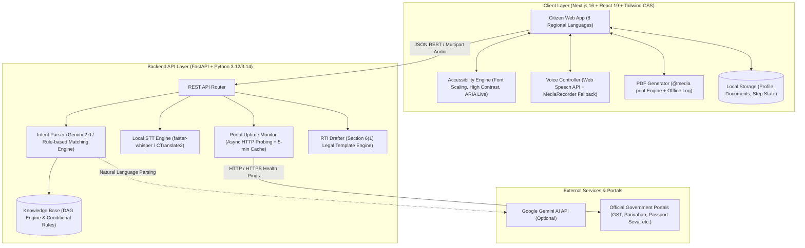

# SarkariScript

**AI-powered government paperwork copilot and auto-filler for Indian citizens.**  
Type or speak your goal in Hindi, English, Hinglish, or 7 regional languages — get a dependency-mapped roadmap across every government portal involved, with forms pre-filled from a citizen profile you enter once. Built for the *"Build What Moves India"* theme.

---

## What It Does

| Feature | Description | Where |
|---|---|---|
| **Multilingual Intent Parser** | Parses goals in Hindi, Hinglish, English, or regional languages into structured life events, location, and conditional dependencies. | `backend/services/intent.py` — Gemini 2.0 Flash when `GEMINI_API_KEY` is set; deterministic on-device keyword engine otherwise |
| **Dependency-Mapped Roadmaps** | Interactive Directed Acyclic Graph (DAG) with prerequisites, turnaround times, and fee breakdowns. | `/roadmap/[eventId]` |
| **"Fill Once, Use Everywhere" Profile** | Pre-fills repetitive fields (PAN, Aadhaar, DOB, address, parent names) across multiple portals from a single local citizen profile. | `/profile` + Step Detail Accordions |
| **DigiLocker Integration (India Stack)** | 1-Click sync of authentic issued records (Aadhaar, PAN, Class X, Ration Card) to auto-fill profile and verify document checklists. | `/profile` + Roadmap Checklists |
| **Document Checklist & Reuse Tracker** | Tracks shared documents (e.g. Aadhaar, Address Proof) across multiple steps with upload-once counters. | Step detail panels + PDF export |
| **Printable PDF Roadmap Generator** | Generates official, clean printable documents with offline checklists, pre-filled field summaries, portal links, and a physical application tracking log. | `/roadmap/[eventId]` → **"Print / PDF Roadmap"** |
| **Voice & Speech Copilot (Alt+V)** | Speak your goal directly in any language. Dual-engine: Native Web Speech API with automatic local Whisper STT fallback. | Global search bar + `/rti` |
| **Audio Reader (Text-to-Speech)** | Listen to roadmaps and step-by-step instructions read aloud in regional voices. | Top action bar on roadmap views |
| **Accessibility Suite (Alt+A)** | Full accessibility toolbar: 3 font scaling levels (100%, 115%, 130%), high-contrast themes (Natural, Light+, Dark+), OpenDyslexic mode, and screen-reader announcements. | Header Accessibility button |
| **Live Portal Health Monitor** | Real-time HTTP uptime pings and latency metrics across all 20 government portals, cached for 5 min. | Home page status board |
| **Grievance to RTI Escalation Engine** | Transforms delayed CPGRAMS / grievance reference numbers into formal Section 6(1) Right to Information (RTI) applications. | `/rti` |

### Supported Life Events Today
1. **Start a Business** (MSME Udyam, GST REG-01, FSSAI Food Licence, Shop & Establishment, EPFO, MCA)
2. **New Aadhaar Card & Update** (UIDAI MyAadhaar, Seva Kendra Slot, Iris/Biometric Enrolment, e-Aadhaar)
3. **Apply for PAN Card / e-PAN** (Instant Paperless e-PAN, NSDL Protean Form 49A, PAN-Aadhaar Linking)
4. **Apply for Ration Card (NFSA)** (AAY/PHH Category Check, State Food RCMS, Inspector Verification, ONORC FPS)
5. **Apply for Voter ID / EPIC Card** (ECI Voters Portal Form 6, BLO Physical Verification, Digital e-EPIC)
6. **Ayushman Bharat Card (PM-JAY)** (NHA Beneficiary Search, Aadhaar e-KYC, ₹5 Lakh Free Cashless Health Cover)
7. **Birth Certificate Registration** (Civil Registration System Form 1, Hospital Slip Verification, QR-Coded Seal)
8. **Buy a Vehicle** (Parivahan Vahan, Road Tax, Permanent RC, HSRP, Fastag)
9. **Driving Licence** (Sarathi Learner Licence, Driving Slot, Permanent DL)
10. **File Income Tax Return (ITR)** (AIS/TIS, e-Filing Portal, Regime Selection, e-Verification)
11. **File a Grievance** (CPGRAMS Central Portal, State Grievance Portals, Escalation Clock)
12. **Fresh Passport Application** (Passport Seva, Fee Payment, PSK Slot, Police Verification)

> Adding a new government journey requires **only one JSON entry** in `backend/kb/knowledge_base.json` — zero code changes.

---

## Architecture



---

## 8 Supported Indian Languages

SarkariScript is fully localized across 8 Indian languages:
- **English**
- **Hindi** (हिन्दी)
- **Bengali** (বাংলা)
- **Marathi** (मराठी)
- **Tamil** (தமிழ்)
- **Telugu** (తెలుగు)
- **Gujarati** (ગુજરાતી)
- **Kannada** (ಕನ್ನಡ)

Switch languages instantly using the language selector in the navigation bar.

---

## Cross-Browser Voice & Speech-to-Text Architecture

SarkariScript features a resilient dual-engine voice architecture:

1. **Native Web Speech API**: Uses browser-native speech recognition for zero-latency streaming on supported browsers (Chrome, Edge, Safari).
2. **Offline Local Whisper Fallback**: If native Web Speech is blocked (e.g. Brave browser, mobile browsers without speech services, or offline environments), the frontend seamlessly streams recorded audio to `POST /api/stt/transcribe`.
3. **Backend faster-whisper Engine**: Runs a local, private [faster-whisper](https://github.com/SYSTRAN/faster-whisper) `base` model (~75 MB) on the server — 100% private, no external APIs or keys required.

### STT Configuration (Optional Environment Variables)
| Variable | Default | Purpose |
|---|---|---|
| `SARKARISCRIPT_STT_MODEL` | `base` | Whisper model size (`tiny`, `base`, `small`) |
| `SARKARISCRIPT_STT_DEVICE` | `auto` | Execution device (`cpu`, `cuda`, or `auto`) |
| `SARKARISCRIPT_STT_COMPUTE` | `auto` | Compute precision type (`int8`, `float32`, `auto`) |
| `SARKARISCRIPT_STT_MODEL_DIR` | `~/.cache/huggingface/hub` | Cache directory for downloaded Whisper models |

---

## Printable PDF Roadmap Generator

The **Print / PDF Roadmap** feature transforms any interactive roadmap into a structured, multi-page printable document designed for offline use:
- **Official Print Header**: Timestamp, applicant name, state/city, estimated total time, and step summary.
- **Master Document Checklist**: Pre-flight checklist with printable `[ ]` checkmarks to verify physical photocopies before visiting offices.
- **Step-by-Step Execution Guide**: Official portal URLs, fees, pre-filled form fields, and filing tips.
- **Physical Application Tracking Log**: Printable table to record application reference numbers, submission dates, acknowledgment slips, officer contacts, and follow-up notes.

---

## Accessibility & Universal Design (WCAG 2.2 AA)

Built from the ground up to be accessible for every citizen:
- **Font Scaling (`A`, `A+`, `A++`)**: 100%, 115%, and 130% scaling, engineered with fluid wraps for ultra-small mobile screens (e.g. iPhone SE 320px).
- **High-Contrast Themes**:
  - `Natural`: Warm paper tones for balanced reading.
  - `Light+`: High-contrast pure white background with dark black borders.
  - `Dark+`: Deep OLED black (`#000000`) for high contrast in low light.
- **High-Legibility / Dyslexia-Friendly Mode**: Enhanced letter spacing and dyslexia-friendly font styling.
- **Screen Reader Announcements**: Non-visual live notifications for step toggles, voice states, and route transitions.
- **Keyboard Shortcuts**:
  - `Alt + V`: Toggle voice search dictation
  - `Alt + A`: Open accessibility preferences modal
  - `Alt + H`: Quick navigation home
  - `Esc`: Close open modal/drawer

---

## Privacy First

- **Zero Cloud Storage for Personal Data**: Citizen profile data, uploaded document checklist states, and roadmap progress (`sarkariscript:v2`) are stored **exclusively in your browser's local storage**.
- No personal Aadhaar, PAN, or profile data is stored on backend databases.

---

## Quickstart & Installation

### Option 1: One-Command Start (Recommended)

Run the included automated launch script from the project root:

```bash
./start.sh
```

This script automatically:
1. Frees ports `8000` and `3000` if previously occupied.
2. Creates and activates the backend Python virtual environment (`backend/.venv`).
3. Installs backend dependencies and preloads the Whisper STT model.
4. Installs frontend dependencies and builds the Next.js app.
5. Launches both services in detached sessions with health validation:
   - **Frontend Web**: [http://localhost:3000](http://localhost:3000)
   - **Backend API & Swagger Docs**: [http://localhost:8000/docs](http://localhost:8000/docs)

---

### Option 2: Manual Setup

#### 1. Backend (Python 3.12+ / 3.14)
```bash
cd backend
python3 -m venv .venv
source .venv/bin/activate
pip install -r requirements.txt

# Optional: Add Gemini API key for advanced natural language understanding
cp .env.example .env # Add GEMINI_API_KEY=your_key

uvicorn main:app --host 0.0.0.0 --port 8000
```

#### 2. Frontend (Node.js 20+)
```bash
cd frontend
npm install
npm run dev # Starts development server at http://localhost:3000
```

---

## API Reference

| Method | Endpoint | Description |
|---|---|---|
| `GET` | `/api/health` | Service health status check |
| `GET` | `/api/life-events` | Retrieve full list of available life journeys |
| `GET` | `/api/life-events/{id}` | Retrieve specific life event and its DAG step dependencies |
| `POST` | `/api/navigate` | Parse natural language intent `{ query: string }` and return ordered roadmap |
| `GET` | `/api/portals/status` | Live HTTP uptime status and latency across government portals |
| `POST` | `/api/rti/draft` | Generate a formatted Section 6(1) RTI application letter |
| `GET` | `/api/stt/config` | Check local Whisper speech-to-text engine availability |
| `POST` | `/api/stt/transcribe` | Transcribe multipart audio payload (`audio`, `language`) using local Whisper |

---

## 2-Minute Demo Walkthrough

1. **Voice or Text Search**:
   - Type or speak (press `Alt+V`): *"Mujhe Lucknow mein grocery store kholna hai"*.
   - SarkariScript parses your intent, selects the **Start a Business** journey, pre-selects the **Food Business (FSSAI)** condition, and generates a tailored 4-step roadmap.
2. **Fill Once, Use Everywhere**:
   - Open **Citizen Profile** (`/profile`), enter your basic details once (Name, DOB, PAN, Aadhaar).
   - Return to the roadmap — form fields now display green **Pre-filled** badges with zero re-typing required.
3. **Document Checklist**:
   - Check off **Aadhaar Card** once in Step 1 — notice it automatically marks completed in every subsequent step that requires it, with the reusable docs counter updating in real time.
4. **Printable PDF Roadmap**:
   - Click **"Print / PDF Roadmap"** (or `Ctrl+P`) — preview the print-formatted document with offline checklists, portal links, and the physical application verification table.
5. **RTI Escalation**:
   - Go to **RTI Drafter** (`/rti`), enter an overdue grievance registration number (e.g. `PMOPG/E/2026/0123456`) pending 45 days, and click **Generate RTI Application** to obtain a ready-to-file Section 6(1) letter.

---

> **Disclaimer**: This is an open-source civic technology project built for demonstration and hackathon purposes. SarkariScript is not affiliated with or endorsed by the Government of India. External portal links point to official government URLs; citizens should always verify requirements directly on the respective portals.
